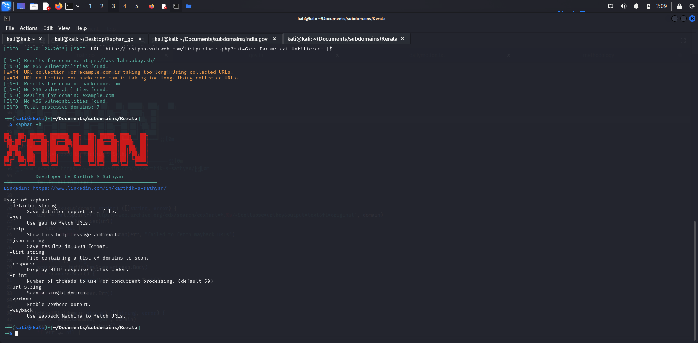
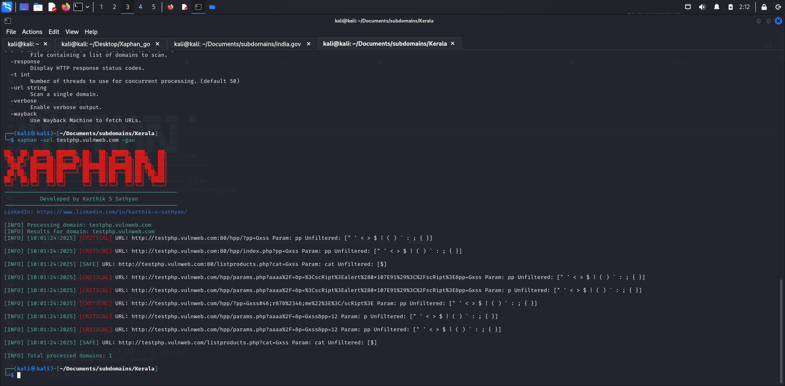

<div align="center">
  

  # Xaphan

  **An Advanced Automated Cross-Site Scripting (XSS) Vulnerability Scanner**

  [](https://opensource.org/licenses/MIT)
  [](https://golang.org/)
  [](https://github.com/Karthikdude/Xaphan/releases)

</div>

---

## 📖 Introduction

**Xaphan** is a powerful, highly-customizable command-line tool designed to automate the detection of Cross-Site Scripting (XSS) vulnerabilities. By identifying unfiltered parameters in web applications across a multitude of sources, it provides security professionals and developers with a comprehensive, reliable analysis of potential attack vectors.

Xaphan is built to be efficient, easy to use, and integrates seamlessly into security workflows.

---

## ✨ Key Features

- **Automated XSS Detection**: Rapidly identifies potential XSS vulnerabilities in web applications.
- **Extensive URL Fetching**: Supports multiple robust gathering methods—both passive (`Wayback Machine`, `gau`, `URLFinder`) and active (`Katana`, `Arjun`, `Gospider`, `Hakrawler`).
- **Comprehensive Scanning (`-all`)**: Maximize coverage by running all URL collection tools simultaneously.
- **Actionable Reporting**: Provides intuitive CLI feedback, detailed JSON exports, and stunning HTML visualizations.
- **Pipeline Checkpoints**: Save raw, GF-filtered, or URO-optimized URLs locally to chain with other tools.
- **Highly Performant**: Concurrent processing via scalable worker threads drastically reduces scan times.
- **Stealth & Stability**: Built-in User-Agent randomization, HTTP proxy support, customizable timeouts, and request retries.

### 🆕 What's New in Version 3.0?

* **Modular Architecture**: Completely refactored the Go codebase into a clean, maintainable package structure (`core`, `fetcher`, `scanner`, `reporter`, `runner`).
* **Test Coverage**: Added distinct unit, component, and integration tests to ensure reliability.
* **Scan Type Display**: Visual indicators in the console distinguish between **Passive** (green) and **Active** (red) scans.
* **Expanded Tool Arsenal**: Native integration with `Katana`, `URLFinder`, `Arjun`, `Gospider`, and `Hakrawler`.
* **Parallel Extraction (`-all`)**: The new `-all` flag aggregates and deduplicates results from all active and passive collectors in record time.

---

## 🚀 Installation & Setup

Xaphan utilizes advanced pattern matching and rendering engines. Ensure you have **Go 1.20+** installed, along with the required companion tools.

### 1. Clone the Repository

```bash
git clone https://github.com/Karthikdude/Xaphan
cd Xaphan
```

### 2. Install Dependencies

```bash
go mod tidy
```

### 3. Install Required Companion Tools

Xaphan dynamically wraps several of the community's best URL extraction and parsing tools. You must have them accessible in your system's `$PATH`.

```bash
# Core Tools
go install github.com/lc/gau/v2/cmd/gau@latest
go install github.com/tomnomnom/waybackurls@latest
go install github.com/tomnomnom/gf@latest
go install github.com/s0md3v/uro@latest
go install github.com/KathanP19/Gxss@latest
go install github.com/Emoe/kxss@latest

# Advanced Gatherers (Required for full capabilities)
go install -v github.com/projectdiscovery/katana/cmd/katana@latest
go install -v github.com/projectdiscovery/urlfinder/cmd/urlfinder@latest
go install github.com/hakluke/hakrawler@latest
go install github.com/jaeles-project/gospider@latest
pip install arjun  # or use pipx: pipx install arjun
```

### 4. Build and Install

```bash
go build -o xaphan main.go
sudo mv xaphan /usr/local/bin/
```

> **Note:** If you run into command-not-found issues with tools like `gau` or `gf`, ensure your `~/go/bin` directory is in your `$PATH`.

---

## 🛠️ Usage Guide

Xaphan's command-line interface is intuitive. See exactly what is happening under the hood with verbose logging, or keep it quiet for CI/CD integrations.



### Basic Scans

**Scan a single domain (Passive):**
```bash
xaphan -url testphp.vulnweb.com -gau
# or
xaphan -url testphp.vulnweb.com -wayback
```

**Scan a list of domains from a file (Passive):**
```bash
xaphan -list targets.txt -gau
```

### Advanced Workflows

**1. The "Kitchen Sink" Scan**
Run all known active and passive fetchers concurrently against a single target, printing verbose output:
```bash
xaphan -url example.com -all -verbose
```

**2. Active Deep Crawl with Katana**
Crawl specifically using Katana up to 3 directories deep:
```bash
xaphan -url example.com -katana -depth 3
```

**3. Generate Stakeholder Reports**
Scan passively via Wayback Machine and output an interactive HTML report:
```bash
xaphan -url testphp.vulnweb.com -wayback -html report.html
```

**4. Pipeline Tool Chaining**
If you want to view exactly what Xaphan is extracting at each stage of its pipeline (`raw` -> `gf` -> `uro`):
```bash
xaphan -url testphp.vulnweb.com -gau -save raw-urls.txt -save-gf gf-urls.txt -save-uro uro-urls.txt
```

---

## ⚙️ Configuration Options

| Flag | Description | Type |
|---|---|---|
| `-url` | Scan a single domain | String |
| `-list` | File containing a list of domains to scan | String |
| `-all` | Use **all** URL extractor tools for comprehensive scanning | Bool |
| `-gau` / `-wayback` | Passive: Use GAU or Wayback Machine | Bool |
| `-katana` / `-gospider` | Active: Use Katana or Gospider web crawlers | Bool |
| `-arjun` | Active: Discover hidden query parameters | Bool |
| `-urlfinder` | Passive: Extract URLs from JS files | Bool |
| `-hakrawler` | Active: Fast endpoint discovery | Bool |
| `-verbose` | Enable verbose, detailed terminal output | Bool |
| `-response` | Display HTTP response status codes for vulnerable endpoints | Bool |
| `-html` / `-json` | Save findings into HTML or JSON formats | String |
| `-proxy` | Proxy traffic (e.g., `http://127.0.0.1:8080`) | String |
| `-exclude` | Exclude URLs matching comma-separated patterns (e.g. `logout,admin`) | String |
| `-t` | Number of concurrent threads (Default: 50) | Int |
| `-depth` | Maximum crawling depth for active scanners (Default: 2) | Int |

---

## 📊 Results & Reporting



When vulnerabilities are discovered, Xaphan categorizes them explicitly:

* **[CRITICAL]** - High predictability of execution (contains symbols like `<`, `>`, `"`, `'`, `script`, `onerror`).
* **[MEDIUM]** - Contains potentially manipulatable boundaries (e.g., `$`, `|`, `eval`, `alert`).
* **[LOW]** - Low risk but potentially unescaped artifacts (`[`, `]`, `\`).
* **[SAFE]** - Analyzed, but no immediate risk identified.

### Export Formats
Xaphan supports clean tabular console output, structured log files (`-detailed`), machine-readable `JSON`, or clean `HTML` dashboard templates suitable for client delivery.

---

## 🛠️ Architecture

As of `v3.0.0`, Xaphan features a highly decoupled architecture inside `pkg/`:
* `core/`: Configurations and state management.
* `fetcher/`: Connectors for Wayback, GAU, Katana, Arjun, etc.
* `scanner/`: Execution wrappers for GF and URO, feeding data to Gxss and kxss.
* `reporter/`: Formatters for CLI, HTML, and JSON representations.
* `runner/`: Go-routine orchestration.

---

## 🤝 Contributing

Contributions are incredibly welcome!

1. Fork the repository.
2. Create a feature branch: `git checkout -b feature/amazing-feature`.
3. Commit your changes: `git commit -m 'Added an amazing feature'`.
4. Push to the branch: `git push origin feature/amazing-feature`.
5. Open a Pull Request!

If you encounter issues such as dependency hiccups with specific GOOS architectures, please check the [Common Errors & Solutions](issues.md) document first.

---

## 📜 License & Author

**License:** Distributed under the [MIT License](LICENSE).

**Developed with ❤️ by Karthik S Sathyan**
* 🌐 **Website:** [Karthik's Portfolio](https://karthik-s-sathyan.vercel.app)
* 💼 **LinkedIn:** [karthik-s-sathyan](https://www.linkedin.com/in/karthik-s-sathyan/)

<div align="center">
  <i>"Automating reconnaissance, securing the web."</i>
</div>
