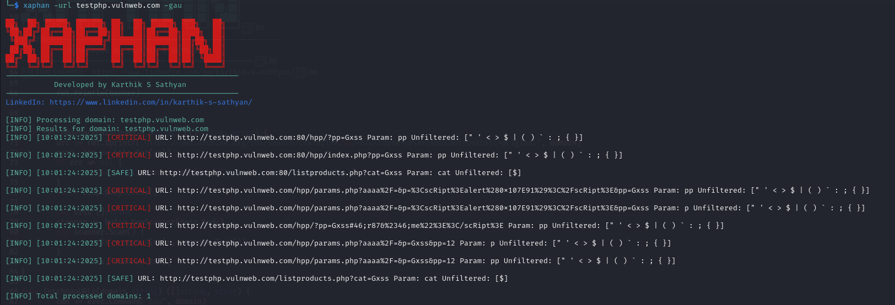

# Xaphan


## Introduction

Xaphan is a command-line tool designed to automate the detection of Cross-Site Scripting (XSS) vulnerabilities by identifying unfiltered parameters in web applications. It leverages various tools and APIs to fetch URLs, analyze them for potential XSS risks, and provide detailed reports. Xaphan is built to be efficient, easy to use, and highly customizable, making it a valuable asset for security professionals and developers alike.

## Version 3.0 Highlights

- **Comprehensive Scanning**: New `-all` command to use all URL extractor tools for thorough scanning
- **Scan Type Display**: Visual indicators showing whether a scan is passive or active
- **Additional Tool Integration**: Support for Katana, URLFinder, Arjun, Gospider, and Hakrawler
- **Parallel Processing**: Run multiple tools simultaneously with the `-all` flag
- **Improved URL Deduplication**: Efficiently combine and deduplicate URLs from multiple sources

## Version 2.0 Highlights

- **New Modern UI**: Improved banner display and progress indicators
- **URL Saving Functionality**: Save URLs at different stages of the pipeline process
- **Enhanced Tool Integration**: Better compatibility with Gxss, kxss and uro tools
- **Cross-Platform Support**: Improved support for both Windows and Unix-based systems
- **More Detailed Output**: Better feedback during the scanning process

## Features

- **Automated XSS Detection**: Automatically detects XSS vulnerabilities in web applications.
- **Multiple URL Fetching Options**: Supports fetching URLs using Wayback Machine, gau, Katana, URLFinder, Arjun, Gospider, Hakrawler, and more.
- **Comprehensive Scanning**: Use the `-all` flag to run all URL collection tools simultaneously for maximum coverage.
- **Scan Type Indicators**: Visual indicators showing whether a scan is passive (green) or active (red).
- **URL Saving Functionality**: Save collected URLs at different stages (raw, after GF, after URO).
- **Detailed Reporting**: Provides detailed and JSON formatted reports of the findings.
- **Verbose Output**: Offers verbose output for detailed inspection.
- **HTTP Response Status Check**: Checks the HTTP response status codes of the URLs.
- **Concurrent Processing**: Utilizes multiple threads for concurrent processing of domains, significantly speeding up the scanning process.
- **Rate Limiting**: Implements rate limiting to avoid overwhelming APIs and external services.
- **Customizable Timeout**: Allows users to set custom timeouts for URL collection and status checks.
- **Progress Tracking**: Displays real-time progress for long-running scans.
- **User Agent Randomization**: Randomizes user agents to avoid detection.
- **Proxy Support**: Allows the use of proxies for anonymity.
- **URL Filtering**: Excludes URLs containing specific patterns.
- **Retry Mechanism**: Automatically retries failed requests.
- **HTML Reports**: Generates visually appealing HTML reports with statistics.
- **Cross-Platform Compatibility**: Works seamlessly across Windows, Linux, and macOS.

## Installation

To install Xaphan, follow these steps:

1. **Clone the Repository**:
   ```sh
   git clone https://github.com/Karthikdude/Xaphan
   cd Xaphan
   ```

2. **Install Dependencies**:
   ```sh
   go mod tidy
   ```

3. **Install Additional Tools**:
   - Ensure you have the following tools installed. You can install them using the following commands:
     ```sh
     # Core tools
     go install github.com/lc/gau/v2/cmd/gau@latest
     go install github.com/tomnomnom/waybackurls@latest
     go install github.com/tomnomnom/gf@latest
     go install github.com/s0md3v/uro@latest
     go install github.com/KathanP19/Gxss@latest
     go install github.com/Emoe/kxss@latest
     
     # New tools
     go install -v github.com/projectdiscovery/katana/cmd/katana@latest
     go install -v github.com/projectdiscovery/urlfinder/cmd/urlfinder@latest
     go install github.com/hakluke/hakrawler@latest
     go install github.com/jaeles-project/gospider@latest
     pip install arjun  # or use pipx: pipx install arjun
     ```

4. **Build the Tool**:
   ```sh
    go build -o xaphan main.go
   ```
   **Replace the Existing Binary: If you previously moved the binary to /usr/local/bin**:
   ```sh
    sudo mv xaphan /usr/local/bin/
   ```
## Common Errors and Solutions

   [Additional Details and Steps](issues.md)

---

## Usage


### Basic Usage

To scan a single domain:
```sh
xaphan -url testphp.vulnweb.com -wayback
```
or
```sh
xaphan -url testphp.vulnweb.com -gau
```

To scan a list of domains from a file:
```sh
xaphan -list domains.txt -wayback
```
or
```sh
xaphan -list domains.txt -gau
```

### Options

- `-url`: Scan a single domain.
- `-list`: File containing a list of domains to scan.
- `-wayback`: Use Wayback Machine to fetch URLs (passive).
- `-gau`: Use gau to fetch URLs (passive).
- `-urlfinder`: Use URLFinder to extract URLs from JavaScript files (passive).
- `-katana`: Use Katana crawler to fetch URLs (active).
- `-gospider`: Use Gospider for web crawling (active).
- `-hakrawler`: Use Hakrawler for web crawling (active).
- `-arjun`: Use Arjun to find query parameters (active).
- `-all`: Use all URL extractor tools for comprehensive scanning (only for single domain).
- `-verbose`: Enable verbose output.
- `-response`: Display HTTP response status codes.
- `-json`: Save results in JSON format.
- `-detailed`: Save detailed report to a file.
- `-html`: Save results in HTML format with visualizations.
- `-save`: Save raw URLs collected from Wayback/GAU to a file.
- `-save-gf`: Save URLs after GF XSS filtering to a file.
- `-save-uro`: Save URLs after URO optimization to a file.
- `-proxy`: Use a proxy for HTTP requests (e.g., http://127.0.0.1:8080).
- `-depth`: Set the maximum scan depth (default: 2).
- `-exclude`: Exclude URLs containing specific patterns (comma-separated).
- `-timeout`: Set timeout for requests in seconds (default: 30).
- `-retry`: Set the number of retry attempts for failed requests (default: 3).
- `-t`: Number of threads to use for concurrent processing (default: 50).
- `-h`: Show this help message and exit.

### Example

```sh
xaphan -url testphp.vulnweb.com -gau -json output.json
```

### Additional Examples

Scan a domain using wayback with HTML report:
```sh
xaphan -url testphp.vulnweb.com -wayback -html report.html
```

Save URLs at different stages of processing:
```sh
xaphan -url testphp.vulnweb.com -gau -save raw-urls.txt -save-gf gf-urls.txt -save-uro uro-urls.txt
```

Scan with proxy and exclude certain paths:
```sh
xaphan -url testphp.vulnweb.com -gau -proxy http://127.0.0.1:8080 -exclude login,admin,static
```

Scan multiple domains with custom timeout and retry:
```sh
xaphan -list domains.txt -gau -timeout 60 -retry 5 -t 100
```

Comprehensive scan using all tools for a single domain:
```sh
xaphan -url example.com -all -verbose
```

Active scanning with Katana crawler:
```sh
xaphan -url example.com -katana -depth 3
```

Combining passive tools for non-intrusive scanning:
```sh
xaphan -url example.com -wayback -gau -urlfinder
```

## URL Saving Functionality

Version 2.0 introduces the ability to save URLs at different stages of the processing pipeline:

- `-save filename.txt`: Saves the raw URLs collected from Wayback Machine or GAU
- `-save-gf filename.txt`: Saves URLs after they've been filtered by GF's XSS pattern matcher
- `-save-uro filename.txt`: Saves URLs after they've been optimized by URO

The saved files will include the domain name and stage in the filename, for example:
- `filename-example.com-raw.txt`
- `filename-example.com-gf.txt`
- `filename-example.com-uro.txt`

This functionality is particularly useful for:
- Debugging the scanning process
- Using the collected URLs with other tools
- Running multiple analyses on the same set of URLs
- Creating a dataset of potentially vulnerable endpoints

## Tools

Xaphan utilizes the following tools for URL fetching and XSS detection:

| Tool         | Description                                                                 | Type    |
|--------------|-----------------------------------------------------------------------------|--------|
| **gau**      | A fast URL collector.                                                         | Passive |
| **waybackurls** | Fetches URLs from the Wayback Machine.                                       | Passive |
| **urlfinder**| Extracts URLs from JavaScript files.                                          | Passive |
| **katana**   | A fast crawler designed to crawl web applications.                            | Active  |
| **gospider** | A web spider that crawls websites and extracts URLs.                          | Active  |
| **hakrawler**| A fast web crawler designed for easy, quick discovery of endpoints.          | Active  |
| **arjun**    | HTTP parameter discovery suite to find query parameters.                      | Active  |
| **gf**       | A grep for URLs.                                                              | Utility |
| **uro**      | A tool to unfurl and rebuild URLs.                                           | Utility |
| **Gxss**     | A tool to detect XSS vulnerabilities.                                          | Testing |
| **kxss**     | A tool to detect XSS vulnerabilities.                                          | Testing |

## Results



Xaphan provides detailed results for each domain scanned. The results include:

- **Timestamp**: The time when the scan was performed.
- **Severity**: The severity level of the XSS vulnerability (CRITICAL, MEDIUM, LOW, SAFE).
- **URL**: The URL where the XSS vulnerability was found.
- **Status**: The HTTP response status code.
- **Unfiltered Symbols**: The symbols that were found unfiltered in the URL.

## HTML Reports

The HTML report provides a visual representation of the scan results, including:

- A summary of all findings categorized by severity
- Detailed information about each vulnerability
- Color-coded entries based on severity
- Statistics about the scan

To generate an HTML report, use the `-html` flag followed by the output file name:

```sh
xaphan -url testphp.vulnweb.com -gau -html report.html
```

## Changelog

### Version 3.0.0
- Added support for additional tools: Katana, URLFinder, Arjun, Gospider, and Hakrawler
- Implemented the `-all` flag for comprehensive scanning using all tools
- Added scan type indicators (Passive/Active) for better visibility
- Improved parallel processing for multiple tools
- Enhanced URL deduplication for combined results
- Added detailed progress reporting for comprehensive scans

### Version 2.0.0
- New modern UI with improved banner display
- Added URL saving functionality at different pipeline stages
- Enhanced tool integration with better command handling
- Improved cross-platform support
- Fixed issues with GAU, Gxss and kxss integration
- Better handling of command outputs and error messages

### Version 1.1.0
- Added HTML report generation
- Improved error handling
- Enhanced user agent randomization 
- Added proxy support
- Added retry mechanism for failed requests

### Version 1.0.0
- Initial release
- Basic XSS scanning functionality
- Support for Wayback Machine and GAU URL collection

## Contributing

Contributions are welcome! Please feel free to submit issues and enhancement requests. If you would like to contribute, follow these steps:

1. Fork the repository.
2. Create a new branch (`git checkout -b feature-branch`).
3. Commit your changes (`git commit -am 'Add new feature'`).
4. Push to the branch (`git push origin feature-branch`).
5. Create a new Pull Request.

## License

This project is licensed under the MIT License. See the [LICENSE](LICENSE) file for details.

## Contact

For more information, please contact [Karthik S Sathyan](https://karthik-s-sathyan.vercel.app).

---

Developed by Karthik S Sathyan.  [LinkedIn](https://www.linkedin.com/in/karthik-s-sathyan/)

---


