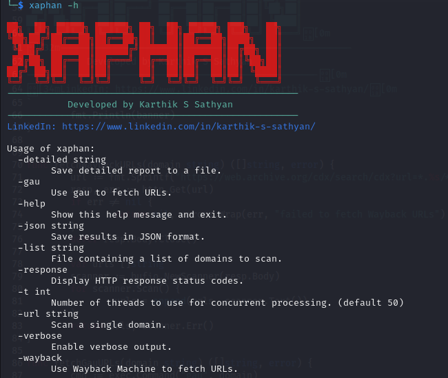

# Xaphan


## Introduction

Xaphan is a command-line tool designed to automate the detection of Cross-Site Scripting (XSS) vulnerabilities by identifying unfiltered parameters in web applications. It leverages various tools and APIs to fetch URLs, analyze them for potential XSS risks, and provide detailed reports. Xaphan is built to be efficient, easy to use, and highly customizable, making it a valuable asset for security professionals and developers alike.

## Features

- **Automated XSS Detection**: Automatically detects XSS vulnerabilities in web applications.
- **Multiple URL Fetching Options**: Supports fetching URLs using Wayback Machine, gau, and other custom methods.
- **Detailed Reporting**: Provides detailed and JSON formatted reports of the findings.
- **Verbose Output**: Offers verbose output for detailed inspection.
- **HTTP Response Status Check**: Checks the HTTP response status codes of the URLs.
- **Concurrent Processing**: Utilizes multiple threads for concurrent processing of domains, significantly speeding up the scanning process.
- **Rate Limiting**: Implements rate limiting to avoid overwhelming APIs and external services.
- **Customizable Timeout**: Allows users to set custom timeouts for URL collection and status checks.
- **Progress Tracking**: Displays real-time progress for long-running scans.
- **User Agent Randomization**: Randomizes user agents to avoid detection.
- **Proxy Support**: Allows the use of proxies for anonymity.
- **URL Filtering**: Excludes URLs containing specific patterns.
- **Retry Mechanism**: Automatically retries failed requests.
- **HTML Reports**: Generates visually appealing HTML reports with statistics.

## Installation

To install Xaphan, follow these steps:

1. **Clone the Repository**:
   ```sh
   git clone https://github.com/Karthikdude/Xaphan
   cd Xaphan
   ```

2. **Install Dependencies**:
   ```sh
   go mod tidy
   ```

3. **Install Additional Tools**:
   - Ensure you have `gau`, `waybackurls`, `gf`, `uro`, `Gxss`, and `kxss` installed. You can install them using the following commands:
     ```sh
     go install github.com/lc/gau/v2/cmd/gau@latest
     go install github.com/tomnomnom/waybackurls@latest
     go install github.com/tomnomnom/gf@latest
     go install github.com/tomnomnom/uro@latest
     go install github.com/KathanP19/Gxss@latest
     go install github.com/KathanP19/kxss@latest
     ```

4. **Build the Tool**:
   ```sh
    go build -o xaphan main.go
   ```
   **Replace the Existing Binary: If you previously moved the binary to /usr/local/bin**:
   ```sh
    sudo mv xaphan /usr/local/bin/
   ```
## Common Errors and Solutions

   [Additional Details and Steps](issues.md)

---

## Usage




### Basic Usage

To scan a single domain:
```sh
xaphan -url testphp.vulnweb.com [-wayback] or [-gau]
```

To scan a list of domains from a file:
```sh
xaphan -list domains.txt [-wayback] or [-gau]
```

### Options

- `-url`: Scan a single domain.
- `-list`: File containing a list of domains to scan.
- `-wayback`: Use Wayback Machine to fetch URLs.
- `-gau`: Use gau to fetch URLs.
- `-verbose`: Enable verbose output.
- `-response`: Display HTTP response status codes.
- `-json`: Save results in JSON format.
- `-detailed`: Save detailed report to a file.
- `-html`: Save results in HTML format with visualizations.
- `-proxy`: Use a proxy for HTTP requests (e.g., http://127.0.0.1:8080).
- `-depth`: Set the maximum scan depth (default: 2).
- `-exclude`: Exclude URLs containing specific patterns (comma-separated).
- `-timeout`: Set timeout for requests in seconds (default: 30).
- `-retry`: Set the number of retry attempts for failed requests (default: 3).
- `-t`: Number of threads to use for concurrent processing (default: 50).
- `-h`: Show this help message and exit.

### Example

```sh
xaphan -uurl testphp.vulnweb.com --gau  --json output.json
```

### Additional Examples

Scan a domain using wayback with HTML report:
```sh
xaphan -url testphp.vulnweb.com --wayback --html report.html
```

Scan with proxy and exclude certain paths:
```sh
xaphan -url testphp.vulnweb.com --gau --proxy http://127.0.0.1:8080 --exclude login,admin,static
```

Scan multiple domains with custom timeout and retry:
```sh
xaphan -list domains.txt --gau --timeout 60 --retry 5 --t 100
```

## Tools

Xaphan utilizes the following tools for URL fetching and XSS detection:

| Tool         | Description                                                                 |
|--------------|-----------------------------------------------------------------------------|
| **gau**      | A fast URL collector.                                                         |
| **waybackurls** | Fetches URLs from the Wayback Machine.                                       |
| **gf**       | A grep for URLs.                                                              |
| **uro**      | A tool to unfurl and rebuild URLs.                                           |
| **Gxss**     | A tool to detect XSS vulnerabilities.                                          |
| **kxss**     | A tool to detect XSS vulnerabilities.                                          |

## Results


Xaphan provides detailed results for each domain scanned. The results include:

- **Timestamp**: The time when the scan was performed.
- **Severity**: The severity level of the XSS vulnerability (CRITICAL, MEDIUM, LOW, SAFE).
- **URL**: The URL where the XSS vulnerability was found.
- **Status**: The HTTP response status code.
- **Unfiltered Symbols**: The symbols that were found unfiltered in the URL.

## HTML Reports

The HTML report provides a visual representation of the scan results, including:

- A summary of all findings categorized by severity
- Detailed information about each vulnerability
- Color-coded entries based on severity
- Statistics about the scan

To generate an HTML report, use the `-html` flag followed by the output file name:

```sh
xaphan -url testphp.vulnweb.com --gau --html report.html
```

## Contributing

Contributions are welcome! Please feel free to submit issues and enhancement requests. If you would like to contribute, follow these steps:

1. Fork the repository.
2. Create a new branch (`git checkout -b feature-branch`).
3. Commit your changes (`git commit -am 'Add new feature'`).
4. Push to the branch (`git push origin feature-branch`).
5. Create a new Pull Request.

## License

This project is licensed under the MIT License. See the [LICENSE](LICENSE) file for details.

## Contact

For more information, please contact [Karthik S Sathyan](https://karthik-s-sathyan.vercel.app).

---

Developed by Karthik S Sathyan.  [LinkedIn](https://www.linkedin.com/in/karthik-s-sathyan/)

---


